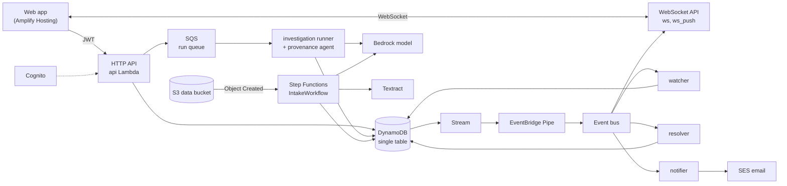

# Found

Sourced disaster reports with a provenance agent, built entirely on AWS.

During a flood or landslide, reports about missing people, damaged roads and open
shelters arrive from police stations, hospitals, NGOs and volunteers at once, often
repeating each other or disagreeing. Found keeps every report as a **claim made by a
source**, never overwrites one, and shows each person's or place's situation with the
report it is based on. A watcher alerts families when something new is reported, and a
provenance agent traces where a report got its information, citing every step.

The full design is in [`docs/PROJECT_DESIGN.md`](docs/PROJECT_DESIGN.md). All demo data is
fictional.

## What it does

- **Sourced timelines.** Organizations publish reports through a form, an upload or pasted
  text. A person has no status field: the page shows the latest status report, cites it,
  and lists every source that disagrees.
- **Alerts.** Families follow a person and get an alert in the app, and optionally by
  email, once per new report that changes what is known. Repeats do not alert.
- **Provenance agent.** A reviewer asks where a report came from. The agent reads the
  report, the sources it names and their own reports, and records one finding: first-hand,
  relayed, or unclear, and whether the relay matches its source. Code checks every
  citation and decides the outcome; a relay is never treated as independent confirmation.
- **Review queue.** Conflicting reports, agent findings, possible duplicate people,
  extracted reports and held sensitive reports wait here, most urgent first.
- **Identity resolver.** New person records are compared with existing ones by name, age
  and place. A reviewer confirms or rejects each proposal; records are never merged.
- **Intake.** A scanned list or pasted text is read (Textract for files), the model
  suggests reports with exact quotes, and code keeps only suggestions whose quote appears
  in the text. Nothing is published until a reviewer confirms it.
- **Map and climate layers.** Report counts per place for people, and roads, bridges,
  shelters, aid points and hazards with their sources and disagreements.

## Rules the code enforces

1. A person has no status field. Status is always derived from claims and cites a claim.
2. Claims are never overwritten or deleted, except by a reset of the demo incident.
3. One alert per (subscription, claim). Repeats of the same status do not alert.
4. The model only labels and chooses tools. Code validates every write and decides every
   outcome, limit and status.
5. A relay is never treated as independent confirmation.
6. No face recognition. No automatic identity merges. Names alone never propose a match.
7. Every agent result is labeled LIVE, CACHED or REPLAYED. Nothing is faked.
8. `DECEASED` reports are held for a reviewer and never sent by text or email
   automatically.

## Architecture



- **Backend** (`backend/found_core`): Python 3.12 and Pydantic v2, ports and adapters.
  Business rules live only in `found_core/domain`, which does no I/O. Lambda handlers in
  `backend/handlers` parse a request or event, call a service and map errors.
- **Events.** Every table write goes through one DynamoDB stream and one EventBridge
  Pipe. Each consumer has its own rule and dead-letter queue, and every consumer write is
  put-if-absent, so repeated or late events change nothing.
- **Agent** (`agent/found_agent`): a Strands agent with a fixed set of tools. It can run
  on AgentCore Runtime behind an AgentCore Gateway, or inside the runner Lambda where
  AgentCore is not available (`agent_host` in `infra/cdk.json`). The tools are the same
  `found_core` code either way.
- **Infrastructure** (`infra`): one AWS CDK app with stacks for data, auth, events, the
  agent, the API, realtime, maps, intake and observability.

## Repository layout

| Path | Contents |
| --- | --- |
| `backend/found_core` | Domain, services, ports and adapters shared by every Lambda |
| `backend/handlers` | Lambda entry points |
| `backend/tests` | Unit tests (in-memory adapter) and integration tests (moto) |
| `agent` | Provenance agent, its tests and the eval set (`agent/evals`) |
| `infra` | AWS CDK app (`app.py`, `stacks/`, `cdk.json`) |
| `web` | React and TypeScript web app (Vite) |
| `data` | Demo dataset generator and fixtures |
| `docs` | Design document and event schemas |

## Running the checks

Each part has its own checks; CI runs all four on every push
([`.github/workflows/test.yml`](.github/workflows/test.yml)).

```bash
# Backend
cd backend
python -m venv .venv && source .venv/bin/activate   # Windows: .venv\Scripts\activate
pip install -e ".[dev]"
ruff check . && pytest -q

# Agent (uses the backend's tools)
cd agent
python -m venv .venv && source .venv/bin/activate
pip install -e ../backend && pip install -e ".[dev]"
ruff check . && pytest -q

# Infrastructure
cd infra
pip install -r requirements-dev.txt
ruff check . && pytest -q

# Web
cd web
npm ci
npm run check        # lint, typecheck, tests, build
```

## Deploying

Everything runs in `ap-south-1` (Mumbai). You need an AWS account, Node.js 22, Python
3.12 and Docker (used to build Lambda packages when a local build is not possible).

### 1. Choose the environment settings

Settings live per environment in `infra/cdk.json` under `envs`:

| Setting | Meaning |
| --- | --- |
| `web_origins` | Origins allowed to call the API and load map tiles |
| `model_id` | Bedrock model ID or inference profile ID used by the agent and intake |
| `agent_host` | `agentcore` (AgentCore Runtime and Gateway) or `lambda` (in the runner) |
| `run_cap`, `model_call_cap` | Monthly limits on investigation runs and model calls |
| `log_retention` | How long Lambda logs are kept |
| `email_from` | Verified SES sender for alert emails; empty means no email |
| `sms_enabled` | Text alerts; off until sender registration is done |
| `alarm_email` | Where alarms are emailed |
| `budget_usd` | Optional monthly budget created by the observability stack |

### 2. Deploy the stacks

```bash
cd infra
npx aws-cdk@2 bootstrap -c env=dev      # once per account and region
npx aws-cdk@2 deploy --all -c env=dev
```

With `agent_host: lambda`, the agent reaches the model through the OpenAI-compatible
`bedrock-mantle` endpoint with a Bedrock API key. Store the key in the secret named by
the `BedrockApiKeySecretArn` output of `Found-dev-Agent`:

```bash
aws secretsmanager put-secret-value --secret-id <BedrockApiKeySecretArn> \
  --secret-string "$(cat path/to/bedrock-api-key)"
```

Confirm the two emails AWS sends: the SES verification link for `email_from`, and the
SNS subscription for `alarm_email`. While SES is in its sandbox, every address that
receives alerts must also be verified once.

### 3. Load the demo and switch on live runs

```bash
# Load the fictional demo incident (inc_demo) through the normal ingest path.
aws lambda invoke --function-name found-dev-demo-reset \
  --cli-binary-format raw-in-base64-out \
  --payload '{"incident_id":"inc_demo","actor":"setup"}' out.json

# Live investigations are off until an admin switches them on.
aws dynamodb put-item --table-name found-main-dev --item \
  '{"PK":{"S":"SETTINGS"},"SK":{"S":"META"},"entity_type":{"S":"SETTINGS"},"live_enabled":{"BOOL":true}}'
```

Admins can reset the demo later with `POST /v1/admin/incidents/inc_demo/reset`; a reset
restores the same 66 fictional reports and touches nothing else.

### 4. Create users

Accounts are created by an admin, who also sets the role and, for publishers, the
organization. Roles are the Cognito groups `admin`, `reviewer`, `publisher` and
`family`.

```bash
aws cognito-idp admin-create-user --user-pool-id <UserPoolId> \
  --username reviewer@example.org --message-action SUPPRESS \
  --user-attributes Name=email,Value=reviewer@example.org Name=email_verified,Value=true
aws cognito-idp admin-set-user-password --user-pool-id <UserPoolId> \
  --username reviewer@example.org --password '<a strong password>' --permanent
aws cognito-idp admin-add-user-to-group --user-pool-id <UserPoolId> \
  --username reviewer@example.org --group-name reviewer
```

A publisher also needs `Name=custom:org_id,Value=<organization id>`, for example
`org_ngo` in the demo incident.

### 5. Build and host the web app

Copy `web/.env.example` to `web/.env.local` and fill it in from the stack outputs
(`UserPoolId`, `UserPoolClientId`, `ApiUrl`, `WebSocketUrl`, and the map key from the
`MapsKeyCommand` output). Then:

```bash
cd web
npm run build
```

Host `web/dist` on Amplify Hosting (a manual deployment needs no Git connection) or any
static host that rewrites unknown paths to `index.html`. The rewrite must leave real
files alone, including `.mjs`: the map's worker is an `.mjs` file, and if the host
answers it with `index.html` the basemap stays blank. Add the site's origin to
`web_origins` and deploy again.

## Trying it

With the demo loaded:

- **Reviewer:** open the review queue, then a relayed report such as "According to
  Central Hospital Demo, Deepak Joshi is safe and unhurt", and start an investigation.
  The finding cites both reports and is held for review because a relay is not
  independent confirmation.
- **Family:** follow a person; when a publisher reports something new about them, the
  alert appears live.
- **Publisher:** publish a report, or upload a scan or paste text on the Upload page and
  watch it wait for a reviewer.
- **Map:** compare people counts per place with the climate layers. The Old Bridge shows
  "bridge open" from volunteers while still listing the police report that it was closed.

## Evals

`agent/evals` holds 20 fixed cases (direct reports, relays that agree or differ, unclear
and injected text, misspelled sources). Run them against a model:

```bash
cd agent
python -m evals.run --model-id <model id> --region ap-south-1 --api-key-file <key file>
```

The run reports attribution and comparison accuracy, citation validity, tool calls,
latency and cost.

## Costs and limits

The stacks scale to zero when idle. Variable spend is capped in code: monthly limits on
investigation runs and model calls, a per-run limit on tool calls, model calls and time,
and the run queue processes at most two runs at once. Ten CloudWatch alarms and one
dashboard watch errors and dead-letter queues. Text alerts stay off until sender
registration is done, so they cost nothing.

## Known limits

- Reports are in English for now.
- Reported places are unverified and shown as reported.
- Changing an identity decision is supported by the API but not yet by the web app.
- The agent does not propose identity matches yet; the resolver does.
